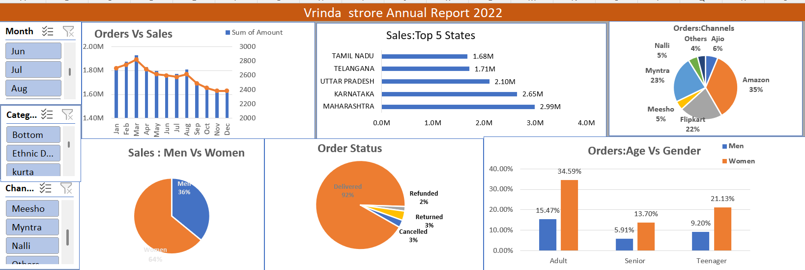

# 📊 Vrinda Store Annual Report 2022 – Excel Dashboard

## 📌 Project Overview

The **Vrinda Store Annual Report 2022** is an interactive Excel dashboard designed to analyze and visualize sales and order data.

The dashboard provides meaningful business insights into sales performance, customer demographics, order status, sales by state, sales channels, and gender-based purchasing behavior.

This project demonstrates practical skills in **Microsoft Excel, Data Analysis, Pivot Tables, Pivot Charts, Slicers, and Dashboard Development**.

---

## 🎯 Project Objective

The main objective of this project is to transform raw sales data into an interactive and easy-to-understand dashboard that helps identify:

- 📈 Sales and order trends
- 🏆 Top-performing states
- 👩‍🦰👨‍🦱 Sales distribution by gender
- 📦 Order status and delivery performance
- 🛒 Sales contribution by shopping channels
- 👥 Customer age and gender analysis
- 📊 Monthly sales and order performance

---

## 🛠️ Tools & Technologies

- **Microsoft Excel**
- Pivot Tables
- Pivot Charts
- Slicers
- Data Cleaning
- Data Analysis
- Dashboard Design
- Excel Formulas
- Data Visualization

---

## 📊 Dashboard Preview



> Interactive dashboard created in Microsoft Excel.

---

## 📈 Key Dashboard Components

### 1. Orders vs Sales
Shows the monthly relationship between the number of orders and total sales amount.

### 2. Top 5 States by Sales
Identifies the top-performing states based on total sales.

### 3. Orders by Channel
Shows the percentage contribution of different sales channels such as:

- Amazon
- Myntra
- Flipkart
- Ajio
- Meesho
- Nalli
- Others

### 4. Sales – Men vs Women
Visualizes the sales contribution from male and female customers.

### 5. Order Status
Provides an overview of different order statuses, including:

- Delivered
- Returned
- Cancelled
- Refunded

### 6. Orders – Age vs Gender
Analyzes order distribution across different age groups and genders.

---

## 🔍 Key Insights

Some of the important insights presented in the dashboard include:

- **Women contribute a higher share of sales than men.**
- **Amazon is the largest sales channel** in the dataset.
- **Maharashtra is among the top-performing states** by sales.
- The majority of orders are successfully **delivered**.
- The dashboard allows users to analyze monthly performance using interactive slicers.
- Age and gender analysis helps understand customer purchasing behavior.

---

## 🎛️ Interactive Filters

The dashboard includes interactive slicers that allow users to filter the analysis based on:

- Month
- Category
- Channel

This makes it easier to explore specific segments of the dataset.

---

## 📂 Project Files

### 📥 Excel Dashboard

You can download and explore the complete Excel dashboard here:

[📊 Download Vrinda Store Data Analysis.xlsx](./Vrinda%20Store%20Data%20Analysis.xlsx)

### 🖼️ Dashboard Image

[🔎 View Dashboard Preview](./Dashboard.png.png)

---

## 📁 Repository Structure

```text
Data-analysis-dashboard/
│
├── Dashboard.png.png
├── Vrinda Store Data Analysis.xlsx
└── README.md
